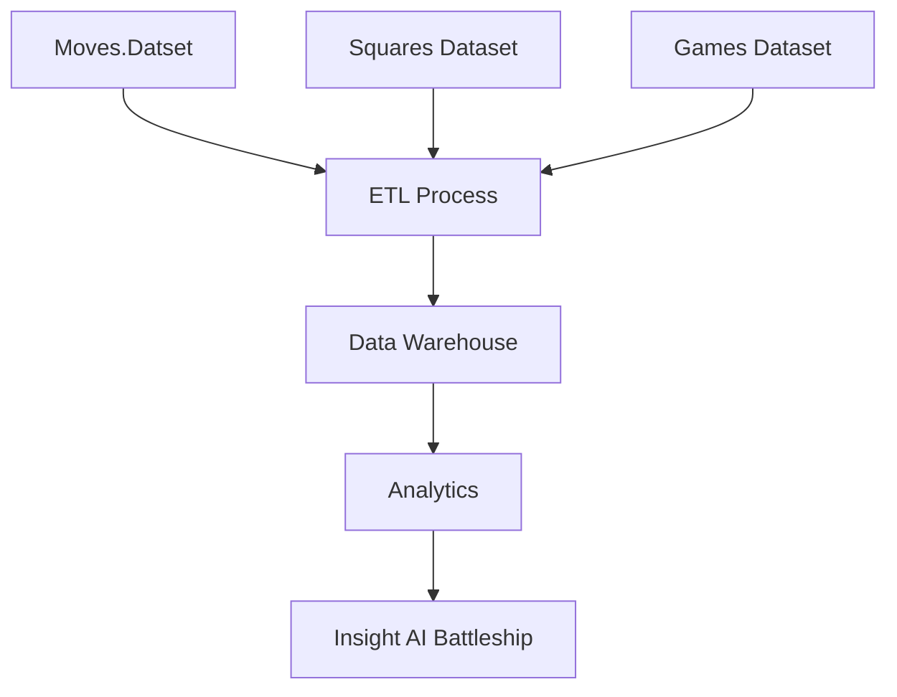

**Project Name**: Project AI Battleship
**Created By**: Kelompok 5
**Date**: 6 Maret 2026

## 1. Executive Summary

### 1.1 Project Overview

- **Tujuan Project**: Membuat bot AI dalam permainna battleship
- **Scope Project**:
  - Analisis dataset Battleship (Moves, Squares, Games)
  - Data preprocessing dan profiling
  - Penggabungan dataset
  - Transformasi data untuk kebutuhan analitik
  - Evaluasi performa AI 
- **Expected Outcomes**:
  - Dataset terintegrasi hasil merge
  - Insight performa AI (win rate, jumlah langkah, dll)
  - Struktur data yang siap digunakan untuk pengembangan AI
- **Timeline**:
  - Pengumpulan data: Minggu 1
  - Analisis & preprocessing: Minggu 2
  - Transformasi & integrasi: Minggu 3
  - Evaluasi & dokumentasi: Minggu 4
  

### 1.2 Stakeholders

- **Project Owner**: Kelompok 5
- **Team Members**:
  - Data Engineer: Adam Noverian
  - Data Analyst: Ghofur Akbar M
  - Project Manager: Alfiansyah Wahyu Pratama

## 2. Data Source Analysis

### 2.1 Data Game Moves

#### Source Details

- **Dataset Name**: Battleship Game Moves
- **URL/Access Point**: https://github.com/cliambrown/battleship-data/blob/main/battleship_game_moves.csv
- **Data Owner**: https://github.com/cliambrown/battleship-data

### Data Analys

- **Format Data**: CSV 
- **Dataset**:
  - battleship_game_moves.csv → 1008 baris, 6 kolom
  - battleship_game_squares.csv → 2400 baris, 7 kolom
  - battleship_games.csv → 59710 baris, 6 kolom
- **Deskripsi**:
  Dataset berisi log permainan Battleship dengan berbagai informasi seperti mode AI,      hasil permainan, jumlah langkah, dan posisi kapal.

## 3. Data Understanding & Struktur Data

### 3.1 Struktur Dataset

- **Moves**:
  - id
  - ai_mode_id
  - autoplay
  - ai_win
  - moves
  - games  
- **Squares**:
  - id
  - ai_mode_id
  - autoplay
  - ai_win
  - ai_ships
  - square
  - games
- **Games**:
  - id
  - timestampUTC
  - ai_win
  - moves
  - autoplay
  - ai_mode_id

#### 3.2 Penjelasan Field Penting

- **ai_mode_id**:
  - 1 = random
  - 2 = probability
  - 3 = learning
- **autoplay**:
  - 0 = manual
  - 1 = otomatis
- **ai_win**:
  - 0 = player menang
  - 1 = AI menang
- **square**:
  - Posisi papan (1-100)

## 4. Data Profiling 

### Analisis statistik sederhana:

- Tidak terdapat missing value (null = 0)
- Semua data bertipe integer
- Data bersih dan konsisten
### Contoh Insight

- Moves memiliki hingga 84 variasi langkah
- Squares memiliki 100 posisi grid
- Games memiliki hampir 60 ribu data permainan

## 5. Data Integration & Struktur Data

### 5.1 Relasi Data

**Dataset dihubungkan melalui:**
- id
- ai_mode_id

### 5.2 Klasifikasi Kolom
**Key/Relasi**
 - id
 - ai_mode_id
**Numerik**
 - Moves
 - games
 - square
 - timestampUTC
**Turunan/Tambahan**
 - ai_win
 - autoplay
 - ai_ships
### Data Transformation
**Beberapa proses transformasi yang dilakukan:**
 - Standarisasi ai_mode_id
 - Validasi Boolean
 - Merge Dataset
 - Konversi Timestamp
 - Feature Engineering:
   - Win Rate AI
   - Rata-rata langkah
   - Frekuensi posisi kapal

## 7. Validasi Data
### Hasil Validasi:
 - Struktur data sesuai
 - Tidak ada missing value
 - Tidak ada duplikasi pada primary key
 - Nilai boolean konsisten
 - Tipe data seragam (integer)

## 8. Data Flow & Arsitektur

### 8.1 Data Flow

### 9. Kesimpulan
 - Dataset Battleship memiliki kualitas data yang sangat baik (bersih & konsisten)
 - Data dapat digunakan untuk analisis performa AI
 - Transformasi data memungkinkan pembuatan insight yang lebih dalam
 - Siap digunakan untuk pengembangan model AI Battleship

